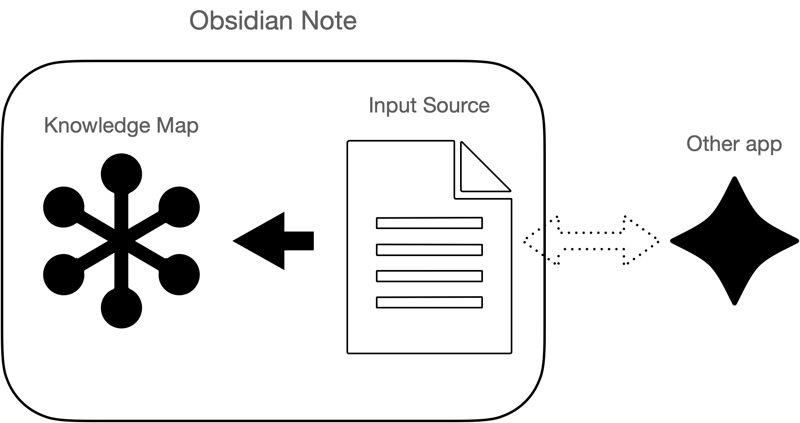

# research-note

The complete note consists of **two** parts:
- Input Source
- Knowledge Map

## Design goal
### Input Source
Notes in this **should satisfy**:
1. Locality: Can focus on the current material without think about the knowledge map. Little or none overhead during note-taking stage.
2. Context Providing: Preserve the structure of the input source when digesting a certain material. Provide the learning context that will be helpful when reviewing.

Notes in this **are** notes taken when:
1. read a textbook
2. read a paper
3. watch youtube academic talks

### Knowledge Map
Notes in this **should satisfy**:
1. Concept based
2. Traceable: a key statement can be traced back to the input material it came from.

Notes in this **are**:
1. Individual concepts

## Structure Sketch

## raw data

## augmentation with structure
### folder
### with obsidian
#### graph
#### tag

### with git

### with other apps
